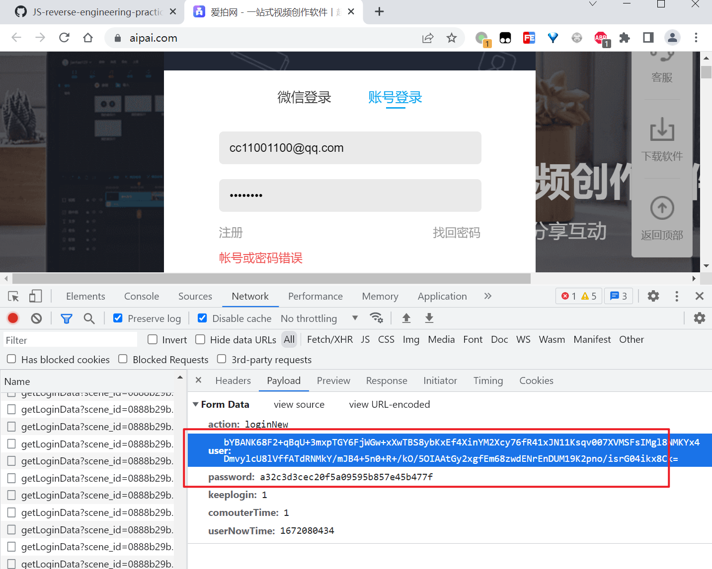
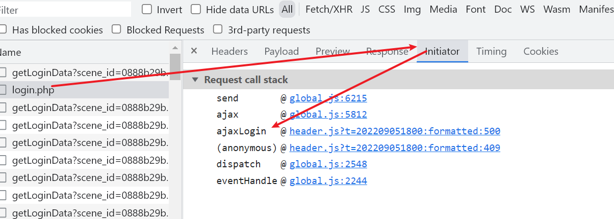
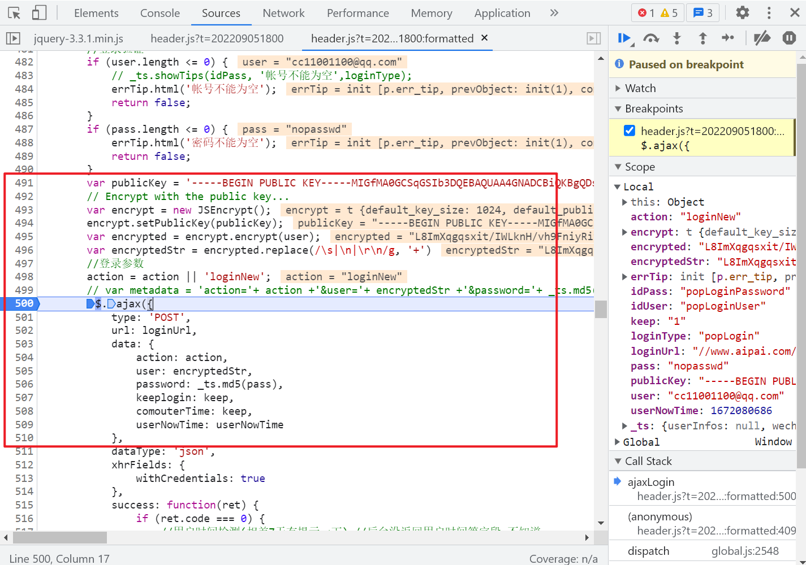

# 爱拍网登录

B站视频：等待更新

代码仓库：https://github.com/JSREP/www.aipai.com-RE

全部文章索引：https://github.com/JSREP/jsrep-index

逆向工具集：https://github.com/JSREI


# 一、逆向目标

```
https://www.aipai.com/
```

登录的时候有个用户名和密码参数都是被加密的：



我们的目标就是搞清楚这个用户名和密码是如何加密的。

# 二、分析过程

通过请求的Initiator直接定位到登录的代码的位置：



可以看到参数是怎么构造的：



密码其实就是对原始密码进行一次MD5，这个没什么好说的。

然后就是用户名：

```js
        var publicKey = '-----BEGIN PUBLIC KEY-----MIGfMA0GCSqGSIb3DQEBAQUAA4GNADCBiQKBgQDs/S8+O5yCcwypPNAQDmcVGY5UEa/iMNDFKcoovLFayhy3Jm/S1L8oYC85Rx8YwWOaQ9Zak0i6eb1AM2JDN7T9+pYb7mf4fzpE4BbXnAc3OqPwxEsNAsAsMKg6GhVxLu2/bfhrKOZ9Arvf6m/n0bGpfdJhIdom6iWh5iG4c+z5vwIDAQAB-----END PUBLIC KEY-----'
        // Encrypt with the public key...
        var encrypt = new JSEncrypt();
        encrypt.setPublicKey(publicKey);
        var encrypted = encrypt.encrypt(user);
        var encryptedStr = encrypted.replace(/\s|\n|\r\n/g, '+')
        
```

是一个RSA加密，并且公钥都放在这里了，就没啥好说的了，分析完毕，代码详见[main.js](main.js)。

# # 三、逆向技术交流群

扫码加入逆向技术交流群：


如群二维码过期，可以加我个人微信（CC11001100-weixin），发送【逆向群】拉你进群：


[点此](https://t.me/jsreijsrei)或扫码加入TG交流群：


